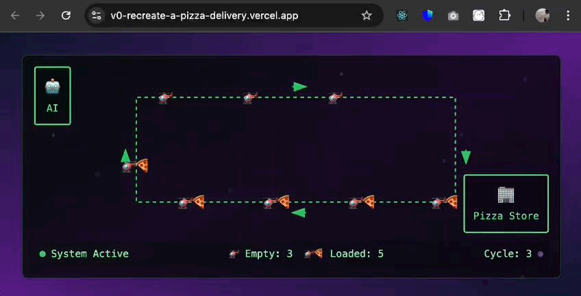

# 🐳 Supabase MCP HTTP Stream Server for n8n

> **One-Click Docker deployment** of Supabase MCP Server with native **HTTP Stream Transport** support for n8n, AI Agents, and modern automation workflows.

[](https://hub.docker.com/r/silverstar3o7/supabase-mcp-http-stream-n8n)
[](https://opensource.org/licenses/MIT)
[](https://mcp-framework.com/docs/Transports/http-stream-transport)

## 🚀 Quick Start

### 🌊 Coolify Deployment (Production)

For production deployment on [Coolify](https://coolify.io), follow these detailed steps:

#### Step 1: Create Resource in Coolify

1. **Navigate to your Coolify dashboard**
2. **Go to Projects** → Select your project (e.g., "My first project")  
3. **Click "Add Resource"** → **"Docker Compose"**
4. **Choose "From GIT Repository"** or **"Raw Docker Compose"**

#### Step 2: Configure Docker Compose

**Option A: From GIT Repository**
- Repository: `https://github.com/BIFROTEK-com/supabase-mcp-http-stream-n8n.git`
- Branch: `main`
- Docker Compose Location: `docker/docker-compose.coolify.yaml`

**Option B: Raw Docker Compose**
Copy the content from [`docker/docker-compose.coolify.yaml`](docker/docker-compose.coolify.yaml)

#### Step 3: Set Environment Variables

Configure these **required** environment variables in Coolify:

```bash
# 🔐 Required: Supabase Configuration
SUPABASE_ACCESS_TOKEN=sbp_your_access_token_here
SUPABASE_PROJECT_REF=your_project_ref_here

# 🔑 Security: API Keys (highly recommended)
MCP_API_KEYS=your-secure-api-key-here

# 📍 Domain Configuration
DOMAIN=your.domain.com

# ⚙️ Optional: Feature Configuration  
MCP_FEATURES=database,docs,development,functions
MCP_READ_ONLY=false
MCP_PORT=3333
NODE_ENV=production

# 🛡️ Optional: Security Settings
MCP_RATE_LIMIT_REQUESTS=100
MCP_RATE_LIMIT_GENERAL=60
MCP_ALLOWED_ORIGINS=*
NODE_LOG_LEVEL=warn
```

#### Step 4: Configure Domain & Traefik

1. **Resource Name**: `supabase-mcp` (or your preferred name)
2. **Domain Configuration**: `https://your.domain.com:3333`
   - ✅ **Format**: `https://your-domain.com:3333`
   - ✅ **Port**: Must be `3333` (the container port)
   - ✅ **Protocol**: Use `https` for SSL termination via Traefik

#### Step 5: Deploy

1. **Save Configuration**
2. **Click "Deploy"**  
3. **Monitor Logs** for successful startup:
   ```
   ✅ MCP HTTP Server running on port 3333
   🚀 Streamable HTTP: POST /mcp
   🌊 SSE: GET/POST /sse
   ❤️ Health: GET /health
   🏠 Landing: GET /
   🔗 Ready for connections!
   ```

#### Step 6: Verify Deployment

Test your deployed instance using the [API Examples](#-api-endpoints) below.

## 🐳 Local Development

1. **Clone the repository:**
```bash
git clone https://github.com/BIFROTEK-com/supabase-mcp-http-stream-n8n.git
cd supabase-mcp-http-stream-n8n
```

2. **Create `.env` file:**
```bash
cp env.example .env
# Edit .env with your Supabase credentials
```

3. **Start the server:**
```bash
cd docker && docker-compose up -d
```

4. **Test the connection:** See [API Examples](#-api-endpoints) below


## 🔌 API Endpoints

### 🚀 HTTP Stream Transport (Recommended)

The modern MCP transport using HTTP streaming for real-time communication:

| Endpoint | Method | Description |
|----------|--------|-------------|
| `POST /mcp` | POST | **Main MCP API** - HTTP Stream Transport |
| `GET /health` | GET | **Health Check** - Server status |
| `GET /` | GET | **API Dashboard** - Landing page (requires API key) |
| `DELETE /mcp` | DELETE | **Session Termination** - Terminate MCP session |

**Example Usage:**
```bash
curl -X POST https://your-domain.com:3333/mcp \
  -H "Content-Type: application/json" \
  -H "Accept: application/json" \
  -H "X-API-Key: your-api-key" \
  -d '{"jsonrpc": "2.0", "id": 1, "method": "tools/list"}'
```

### 🌊 SSE Transport (n8n Compatible)

Server-Sent Events transport for legacy n8n MCP Client Tool Node compatibility:

| Endpoint | Method | Description |
|----------|--------|-------------|
| `GET /sse` | GET | **SSE Connection** - Establish Server-Sent Events stream |
| `POST /messages` | POST | **SSE Messages** - Send JSON-RPC messages via SSE |

**SSE Features:**
- ✅ **Auto Session Management** - Secure crypto-based session IDs
- ✅ **Keep-Alive Pings** - 15-second intervals for connection stability  
- ✅ **n8n Compatibility** - Works with n8n MCP Client Tool Node
- ✅ **Automatic Cleanup** - Sessions auto-terminate on disconnect

**SSE Connection Flow:**
1. **Connect**: `GET /sse` establishes SSE stream
2. **Receive**: Server sends `endpoint` event with sessionId
3. **Send Messages**: `POST /messages?sessionId=<session>` 
4. **Keep-Alive**: Server pings every 15 seconds
5. **Disconnect**: Automatic cleanup on connection close

**Example Usage:**
```bash
# 1. Establish SSE connection
curl -N -H "Accept: text/event-stream" https://your-domain.com:3333/sse

# Server responds:
# event: endpoint
# data: /messages?sessionId=abc123...
# data: {"type":"ready","status":"connected","session":"abc123..."}

# 2. Send messages via returned sessionId
curl -X POST https://your-domain.com:3333/messages?sessionId=abc123... \
  -H "Content-Type: application/json" \
  -d '{"jsonrpc": "2.0", "id": 1, "method": "tools/list"}'
```

## 🛡️ Security Features

- ✅ **API Key Authentication**: Secure access control
- ✅ **Rate Limiting**: DoS protection (configurable)
- ✅ **CORS Protection**: Configurable origin restrictions
- ✅ **Security Headers**: Helmet.js with CSP
- ✅ **Input Validation**: JSON-RPC 2.0 validation
- ✅ **SSL/TLS**: HTTPS support via Traefik

## 📊 MCP Tools Available

| Tool | Description |
|------|-------------|
| `list_tables` | Lists all database tables |
| `list_extensions` | Lists database extensions |
| `execute_sql` | Execute raw SQL queries |
| `apply_migration` | Apply database migrations |
| `search_docs` | Search Supabase documentation |
| `list_edge_functions` | List Edge Functions |
| `deploy_edge_function` | Deploy Edge Functions |
| `get_project_url` | Get project API URL |
| `get_anon_key` | Get anonymous API key |
| `generate_typescript_types` | Generate TypeScript types |
| `list_migrations` | List database migrations |

## 🔧 Configuration

### Environment Variables

| Variable | Required | Default | Description |
|----------|----------|---------|-------------|
| `SUPABASE_ACCESS_TOKEN` | ✅ | - | Supabase Management API token |
| `SUPABASE_PROJECT_REF` | ✅ | - | Your Supabase project reference |
| `MCP_API_KEYS` | ⚠️ | - | Comma-separated API keys |
| `MCP_PORT` | ❌ | `3333` | HTTP server port |
| `MCP_FEATURES` | ❌ | `database,docs,development,functions` | Enabled features |
| `MCP_READ_ONLY` | ❌ | `false` | Read-only mode |
| `MCP_RATE_LIMIT_REQUESTS` | ❌ | `100` | Requests per 15 minutes |
| `MCP_RATE_LIMIT_GENERAL` | ❌ | `60` | Requests per minute |
| `MCP_ALLOWED_ORIGINS` | ❌ | `*` | CORS allowed origins |

### Feature Groups

Enable specific features by setting `MCP_FEATURES`:

- `database` - Database operations (tables, SQL, migrations)
- `docs` - Supabase documentation search
- `development` - Development tools and utilities
- `functions` - Edge Functions management
- `account` - Account management (requires no project scoping)
- `branching` - Database branching operations
- `storage` - Storage management
- `debug` - Debugging tools

## 🔄 n8n Integration

### ⚠️ Important: Built-in MCP Node Issues

The **built-in n8n MCP Client node has known issues** with SSE Stream Transport (Deprecated) and may not work reliably with this server. For the best experience, we **strongly recommend** using the community-developed MCP Client node instead.

### 🌟 Recommended: Community MCP Node

**Use the community node**: [@nerding-io/n8n-nodes-mcp](https://github.com/nerding-io/n8n-nodes-mcp)

This community node provides:
- ✅ **Full HTTP Stream Transport** support (recommended)
- ✅ **Reliable SSE Transport** for legacy compatibility  
- ✅ **Better error handling** and connection stability
- ✅ **Active maintenance** and community support
- ✅ **AI Agent integration** as a tool

### 📦 Installation

1. **Install the community node** in your n8n instance:
   ```bash
   # Via n8n UI: Settings → Community Nodes → Install
   # Package name: @nerding-io/n8n-nodes-mcp
   
   # Or via Docker environment:
   N8N_COMMUNITY_PACKAGES_ENABLED=true
   ```

2. **Enable community nodes as tools** (for AI Agents):
   ```bash
   # Required for using MCP Client as AI Agent tool
   N8N_COMMUNITY_PACKAGES_ALLOW_TOOL_USAGE=true
   ```

### 🚀 Configuration with HTTP Stream Transport

**Recommended Setup:**

1. **Create HTTP Streamable Credentials**:
   - **Base URL**: `https://your.domain.com:3333/mcp`
   - **API Key**: Your configured API key
   - **Transport**: `HTTP Streamable`

2. **Add MCP Client Node**:
   - **Connection Type**: `HTTP Streamable`
   - **Operation**: `List Tools` / `Execute Tool`
   - **Select your credentials**

3. **Example Tool Execution**:
   ```json
   {
     "tool": "list_tables",
     "parameters": {}
   }
   ```

### 🌊 Legacy SSE Configuration (if needed)

**Only if HTTP Stream doesn't work:**

1. **Create SSE Credentials**:
   - **SSE URL**: `https://your.domain.com:3333/sse`
   - **Connection Type**: `Server-Sent Events (SSE)`
   - **Headers**: `X-API-Key: your-api-key`

2. **Configure Node**:
   - **Connection Type**: `Server-Sent Events (SSE)`
   - **Select your SSE credentials**

> **Note**: SSE is deprecated but maintained for compatibility. Always try HTTP Stream first.

### 🤖 AI Agent Integration

The community MCP node works perfectly as an AI Agent tool:

```javascript
// Example AI Agent prompt
I need you to help me analyze my Supabase database. 
First, list all available tables using the list_tables tool.
Then, execute some SQL queries to get insights about the data.
```

**Docker Configuration for AI Agents**:
```yaml
version: '3'
services:
  n8n:
    image: n8nio/n8n
    environment:
      - N8N_COMMUNITY_PACKAGES_ENABLED=true
      - N8N_COMMUNITY_PACKAGES_ALLOW_TOOL_USAGE=true
      - MCP_API_KEY=your-supabase-mcp-api-key
    # ... rest of configuration
```

## 🎯 Use Cases

- **Database Management**: Query and manage Supabase databases
- **AI Agents**: Provide database access to AI assistants
- **Automation**: Integrate with n8n workflows
- **Documentation**: Search Supabase docs programmatically
- **Edge Functions**: Deploy and manage serverless functions
- **Data Analysis**: Execute complex SQL queries
- **Schema Management**: Handle database migrations

## 🔗 Related Projects

- [MCP Framework](https://mcp-framework.com/) - Model Context Protocol
- [Supabase](https://supabase.com/) - Open source Firebase alternative
- [n8n](https://n8n.io/) - Workflow automation platform
- [Coolify](https://coolify.io/) - Self-hosted Heroku alternative

## 📝 License

MIT License - see [LICENSE](LICENSE) file for details.

## 🤝 Contributing

1. Fork the repository
2. Create a feature branch
3. Make your changes
4. Add tests if applicable
5. Submit a pull request

## 🆘 Support

- **GitHub Issues**: [Report bugs or request features](https://github.com/BIFROTEK-com/supabase-mcp-http-stream-n8n/issues)
- **Documentation**: [MCP Framework Docs](https://mcp-framework.com/docs/Transports/http-stream-transport)
- **Supabase**: [Official Documentation](https://supabase.com/docs)

---

**Made with ❤️ by [BIFROTEK](https://github.com/BIFROTEK-com)** 
